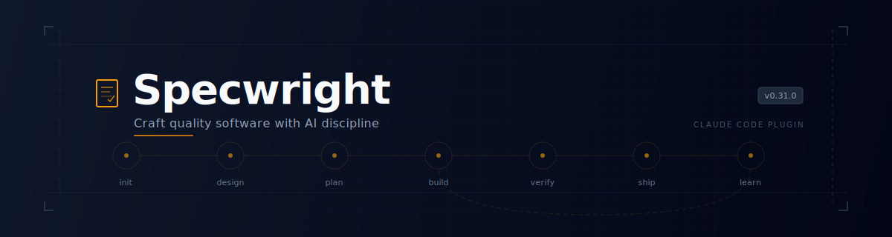
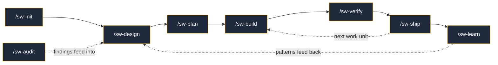

<p align="center">
  
</p>

<p align="center">
  <a href="https://github.com/Obsidian-Owl/specwright/releases"></a>
  <a href="LICENSE"></a>
  <a href="https://github.com/Obsidian-Owl/specwright/stargazers"></a>
  <a href="https://docs.anthropic.com/en/docs/agents-and-tools/claude-code/plugins"></a>
</p>

<p align="center">
  <b>AI agents optimise for <i>done</i>. Specwright optimises for <i>works</i>.</b>
</p>

---

## Why Specwright?

AI agents optimise for "done." That's the problem. Code compiles, tests pass, CI is green — and three days later you find an export nobody imports, a handler that's never called, a validation rule that exists in the spec but not in the code. **The hard part isn't writing code. It's proving it works.**

Specwright closes the **entire loop** — design, plan, build, verify, ship, learn. Every requirement is tracked to implementation evidence. Every PR ships with proof, not promises.

### Without Specwright

- AI optimises for "task done" not "feature works"
- Fast delivery of broken, unwired code
- Tests pass but features aren't connected
- Context loss during long sessions causes drift
- No evidence trail for what was verified
- Every project re-invents the same workflow

### With Specwright

- Specs before implementation, always
- Wiring verification catches orphaned code and broken connections
- Evidence-based PRs with gate proof for every acceptance criterion
- Compaction recovery reloads full context automatically
- Learning system captures failures and promotes patterns across sessions
- Codebase knowledge persists across sessions — no re-discovering the same architecture
- Periodic health checks find systemic debt that per-change gates miss
- One install, configure once, works with any language or framework

### How It Compares

| Capability | Specwright | [Spec Kit](https://github.com/github/spec-kit) | [Oh-My-ClaudeCode](https://github.com/Yeachan-Heo/oh-my-claudecode) | [Superpowers](https://github.com/obra/superpowers) | Manual workflows |
|---|---|---|---|---|---|
| Structured spec writing | Yes | **Yes** — core strength | Yes | Yes | DIY |
| Adversarial TDD (separate tester/executor) | **Yes** | No | Yes | Yes | No |
| Wiring verification (orphaned code, layer violations) | **Yes** | No | No | No | No |
| Evidence-based PRs (criterion → code + test) | **Yes** | No | No | No | No |
| Quality gates with findings (not just badges) | **Yes** | Partial | Yes | Partial | DIY |
| Compaction recovery | **Yes** | No | Yes | No | No |
| Learning system (patterns promoted across sessions) | **Yes** | No | Yes | Yes | No |
| Codebase knowledge persistence | **Yes** | No | Yes | No | No |

Every tool in this space pushes AI-assisted development forward. Specwright's focus is the **verification and evidence gap** — the part between "tests pass" and "it actually works."

## What Makes This Different

Other tools in this space tend to focus on the **front half** of the loop — specification authoring, agent orchestration, or planning scaffolds — then hand off to the AI. The hard part isn't planning or delegation. It's everything after: does the code actually do what was asked? Is it wired up? Is it secure? Can you prove it?

Specwright focuses on the **verification and evidence** side — the part where AI agents actually fail.

**Evidence Pipeline** — Five sequential gates capture proof into structured reports. PRs ship with a compliance matrix mapping every acceptance criterion to code and test evidence. Reviewers don't have to trust — they can verify.

**Wiring Verification** — Static analysis catches orphaned files, unused exports, layer violations, and circular dependencies. Other tools check if code compiles and tests pass. Specwright checks if the code is actually connected.

**Learning System** — Failures are captured, patterns are promoted, and learnings compact into tiered memory (index, themes, raw data). The system gets smarter with every session. Knowledge survives context windows.

**Codebase Knowledge** — During init, Specwright surveys your codebase and builds a persistent knowledge document (`LANDSCAPE.md`) covering architecture, modules, conventions, and gotchas. Design phases load this instantly instead of re-scanning. It stays current — refreshed when stale, incrementally updated after every shipped work unit.

**Codebase Health Checks** — Run `/sw-audit` periodically to find systemic issues that per-change gates miss: architecture debt, complexity growth, convention drift, accumulated workarounds. Findings persist in `AUDIT.md` with stable IDs across re-runs. Design phases surface relevant findings. The learn phase resolves them when addressed.

**Compaction Recovery** — All stateful skills support resume-from-crash. When Claude's context window compacts, Specwright reloads full state from disk — including workflow stage, work unit queue, and gate progress — so no manual re-orientation is needed.

## How It Works



| Phase | What Happens | Key Innovation |
|-------|-------------|----------------|
| **Init** | Detect stack, configure gates, create anchor documents | Auto-detection — don't ask what you can infer |
| **Design** | Triage as Full / Lite / Quick, research codebase, design solution, adversarial critic | Right-sized ceremony — trivial fixes skip the full cycle |
| **Plan** | Decompose into work units, write testable acceptance criteria | Specs grounded in approved design artifacts |
| **Build** | TDD — tester writes hard-to-pass tests, executor makes them pass | Adversarial test-first, not test-after |
| **Verify** | 5 quality gates with evidence capture | Findings shown inline, not just pass/fail badges |
| **Ship** | PR with acceptance criteria mapped to evidence | Every requirement traceable to code + test |
| **Learn** | Capture patterns, promote to constitution | Knowledge compounds across sessions |
| **Audit** | Periodic health check — architecture, complexity, consistency, debt | Finds systemic issues gates miss. Run anytime. |

## Quick Start

Install the plugin:
```
/plugin marketplace add Obsidian-Owl/specwright
/plugin install specwright@specwright
```

Initialize your project:
```
/sw-init
```

Optionally, set up automated guardrails (linters, hooks, CI checks):
```
/sw-guard
```

Then design, plan, and iterate per work unit:
```
/sw-design add-user-authentication
/sw-plan

# for each work unit:
/sw-build
/sw-verify
/sw-ship
```

## Codebase Knowledge and Health

Two optional features keep Specwright informed about your codebase across sessions:

**Landscape** (`LANDSCAPE.md`) — A persistent map of your codebase's architecture, modules, conventions, and integration points. Created automatically during `/sw-init` if you opt in. The design phase loads it for instant context instead of re-scanning every time. Updated incrementally after each shipped work unit.

- Created by: `/sw-init` (survey phase, optional)
- Consumed by: `/sw-design` (auto-refreshed when stale)
- Updated by: `/sw-learn` (after shipping)

**Audit** (`AUDIT.md`) — A persistent record of systemic codebase health issues. Run `/sw-audit` when you want a health check — it's not part of the regular workflow, so use it whenever it makes sense: before starting a large feature, after a refactoring sprint, or on a regular cadence.

```
/sw-audit              # auto-triage: standard or full based on codebase size
/sw-audit src/api/     # focused: analyze only the specified path
/sw-audit --full       # full: parallel analysis across all dimensions
```

Findings persist across runs with stable IDs. When you design new work, relevant findings are surfaced automatically. When you ship work that addresses a finding, the learn phase marks it resolved.

- Created by: `/sw-audit` (run anytime)
- Consumed by: `/sw-design` (surfaces relevant findings during research)
- Resolved by: `/sw-learn` (marks addressed findings as resolved)

## Six Specialized Agents

Specwright delegates to purpose-built agents — each with a distinct role, model, and adversarial stance:

| Agent | Model | Role | Mindset |
|-------|-------|------|---------|
| **Architect** | Opus | Design review, critic, structural analysis | *"What did you miss? What will break?"* |
| **Tester** | Opus | Write tests designed to be hard to pass | *"How can I prove this is wrong?"* |
| **Executor** | Sonnet | Make the tests pass. Minimal code, maximum correctness. | *"What's the simplest thing that works?"* |
| **Reviewer** | Opus | Spec compliance verification | *"Show me the evidence."* |
| **Build Fixer** | Sonnet | Fix build/test failures with minimal diffs | *"Get green, don't refactor."* |
| **Researcher** | Sonnet | External documentation and API lookup | *"What does the official doc say?"* |

## Five Quality Gates

Every work unit passes through configurable gates before shipping. **Default stance: FAIL.** Evidence must prove PASS.

| Gate | Checks | Severity |
|------|--------|----------|
| **Build** | Compilation + test suite pass | BLOCK |
| **Tests** | Assertion strength, boundary coverage, mock discipline | BLOCK/WARN |
| **Security** | Leaked secrets, injection patterns, sensitive data | BLOCK |
| **Wiring** | Orphaned files, unused exports, layer violations, circular deps | WARN |
| **Spec** | Every acceptance criterion mapped to code + test evidence | BLOCK |

## Persistent Documents

Two **anchor documents** drive all decisions and survive context compaction:

**`CONSTITUTION.md`** — Development practices the AI must follow. Testing standards, coding conventions, security requirements. Not suggestions — rules.

**`CHARTER.md`** — Technology vision and architectural invariants. What this project is, who consumes it, what doesn't change.

Two optional **reference documents** accelerate research and track health:

**`LANDSCAPE.md`** — Codebase knowledge: architecture, modules, conventions, gotchas. Loaded on demand, never blocks workflow.

**`AUDIT.md`** — Codebase health findings: systemic debt, complexity growth, convention drift. Loaded on demand, findings have stable IDs.

## Skills

<table>
<tr><td>

**Core Workflow**
| Skill | Purpose |
|-------|---------|
| `/sw-init` | Project setup, constitution, charter |
| `/sw-design` | Research, design, adversarial critic |
| `/sw-plan` | Decompose, spec, acceptance criteria |
| `/sw-build` | TDD implementation |
| `/sw-verify` | Quality gates |
| `/sw-ship` | PR with evidence |

</td><td>

**Utilities**
| Skill | Purpose |
|-------|---------|
| `/sw-guard` | Configure guardrails (hooks, CI) |
| `/sw-status` | Progress and state |
| `/sw-learn` | Pattern capture |
| `/sw-audit` | Codebase health check |

</td></tr>
</table>

<details>
<summary><b>Configuration</b></summary>

Specwright reads project configuration from `.specwright/config.json`:

```json
{
  "project": { "name": "...", "languages": [...] },
  "commands": { "build": "...", "test": "...", "lint": "..." },
  "gates": { "enabled": ["build", "tests", "wiring", "security", "spec"] }
}
```

All configuration is project-specific. Specwright never assumes language, framework, or architecture.

</details>

<details>
<summary><b>Architecture</b></summary>

See `DESIGN.md` for the complete architecture document.

```
specwright/
├── skills/       # 15 SKILL.md files (10 user + 5 gates)
├── protocols/    # 14 shared protocols (loaded on demand)
├── agents/       # 6 custom subagent definitions
├── hooks/        # Session lifecycle hooks
├── DESIGN.md     # Full architecture
└── README.md
```

</details>

## Contributing

Specwright is open source under the MIT license.

1. Fork at [github.com/Obsidian-Owl/specwright](https://github.com/Obsidian-Owl/specwright)
2. Create a feature branch
3. See `CLAUDE.md` for development guidelines
4. Submit a pull request

---

<p align="center">
  If Specwright helps you ship with confidence, <a href="https://github.com/Obsidian-Owl/specwright">a ⭐ helps others find it</a>.
</p>

<p align="center">
  <sub>Built by <a href="https://github.com/Obsidian-Owl">ObsidianOwl</a> · MIT License · v0.9.1</sub>
</p>
