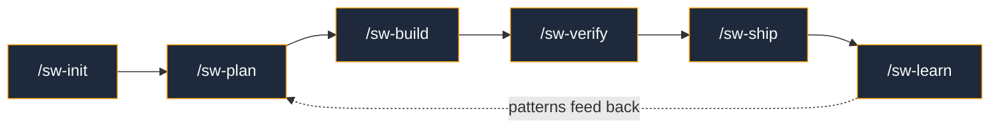

<p align="center">
  
</p>

<p align="center">
  <a href="https://github.com/Obsidian-Owl/specwright/releases"></a>
  <a href="LICENSE"></a>
  <a href="https://github.com/Obsidian-Owl/specwright/stargazers"></a>
</p>

<p align="center">
  <b>AI agents optimise for <i>done</i>. Specwright optimises for <i>works</i>.</b>
</p>

---

## The Problem

AI coding assistants drift from requirements, skip testing, introduce regressions, and ship code that doesn't match what was asked for. Most AI development frameworks address only the specification phase — they help you plan, then leave you on your own.

**Specwright closes the entire loop.** Specs define the target. Quality gates verify the result. Nothing ships without evidence of compliance.

## How It Works



| Phase | What Happens | Key Innovation |
|-------|-------------|----------------|
| **Init** | Detect stack, configure gates, create constitution + charter | Auto-detection, not questionnaires |
| **Plan** | Triage, deep research, design, adversarial critic review | Every plan challenged before commitment |
| **Build** | TDD — tester writes hard-to-pass tests, executor makes them pass | Adversarial test-first, not test-after |
| **Verify** | 5 quality gates with evidence | Findings shown, not just pass/fail badges |
| **Ship** | PR with acceptance criteria mapped to evidence | Reviewers can verify every requirement |
| **Learn** | Capture patterns, promote to constitution | Knowledge compounds across sessions |

## Quick Start

Install the plugin:
```
/plugin marketplace add Obsidian-Owl/specwright
/plugin install specwright@specwright
```

Initialize your project:
```
/sw-init
```

Optionally, set up automated guardrails (linters, hooks, CI checks):
```
/sw-guard
```

Then plan, build, verify, ship:
```
/sw-plan add-user-authentication
/sw-build
/sw-verify
/sw-ship
```

## Six Specialized Agents

Specwright delegates to purpose-built agents — each with a distinct role, model, and adversarial stance:

| Agent | Model | Role | Mindset |
|-------|-------|------|---------|
| **Architect** | Opus | Design review, critic, structural analysis | *"What did you miss? What will break?"* |
| **Tester** | Opus | Write tests designed to be hard to pass | *"How can I prove this is wrong?"* |
| **Executor** | Sonnet | Make the tests pass. Minimal code, maximum correctness. | *"What's the simplest thing that works?"* |
| **Reviewer** | Opus | Spec compliance verification | *"Show me the evidence."* |
| **Build Fixer** | Sonnet | Fix build/test failures with minimal diffs | *"Get green, don't refactor."* |
| **Researcher** | Sonnet | External documentation and API lookup | *"What does the official doc say?"* |

## Five Quality Gates

Every work unit passes through configurable gates before shipping. **Default stance: FAIL.** Evidence must prove PASS.

| Gate | Checks | Severity |
|------|--------|----------|
| **Build** | Compilation + test suite pass | BLOCK |
| **Tests** | Assertion strength, boundary coverage, mock discipline | BLOCK/WARN |
| **Security** | Leaked secrets, injection patterns, sensitive data | BLOCK |
| **Wiring** | Dead code, orphaned files, layer violations, circular deps | WARN |
| **Spec** | Every acceptance criterion mapped to code + test evidence | BLOCK |

## Anchor Documents

Two persistent documents drive all decisions and survive context compaction:

**`CONSTITUTION.md`** — Development practices the AI must follow. Testing standards, coding conventions, security requirements. Not suggestions — rules.

**`CHARTER.md`** — Technology vision and architectural invariants. What this project is, who consumes it, what doesn't change.

## Why Specwright?

| | Specwright | Other AI Frameworks |
|---|-----------|---------------------|
| **Workflow** | plan → build → verify → ship → learn | plan only |
| **Context** | Constitution + Charter persist across sessions | session-based, lost on compaction |
| **Critique** | Every plan challenged by adversarial architect | no critic phase |
| **Verification** | Every requirement mapped to code + test evidence | "it works" (trust me) |
| **Testing** | Tester writes hard-to-pass tests *before* implementation | standard mocks, test-after |
| **Learning** | Patterns promoted from real development | manual documentation |

## Skills

<table>
<tr><td>

**Core Workflow**
| Skill | Purpose |
|-------|---------|
| `/sw-init` | Project setup, constitution, charter |
| `/sw-plan` | Research, design, critic, spec |
| `/sw-build` | TDD implementation |
| `/sw-verify` | Quality gates |
| `/sw-ship` | PR with evidence |

</td><td>

**Utilities**
| Skill | Purpose |
|-------|---------|
| `/sw-guard` | Configure guardrails (hooks, CI) |
| `/sw-status` | Progress and state |
| `/sw-learn` | Pattern capture |

</td></tr>
</table>

<details>
<summary><b>Configuration</b></summary>

Specwright reads project configuration from `.specwright/config.json`:

```json
{
  "project": { "name": "...", "languages": [...] },
  "commands": { "build": "...", "test": "...", "lint": "..." },
  "gates": { "enabled": ["build", "tests", "wiring", "security", "spec"] }
}
```

All configuration is project-specific. Specwright never assumes language, framework, or architecture.

</details>

<details>
<summary><b>Architecture</b></summary>

See `DESIGN.md` for the complete architecture document.

```
specwright/
├── skills/       # 13 SKILL.md files (8 user + 5 gates)
├── protocols/    # Shared protocols (loaded on demand)
├── agents/       # 6 custom subagent definitions
├── hooks/        # Session lifecycle hooks
├── DESIGN.md     # Full architecture
└── README.md
```

</details>

## Contributing

Specwright is open source under the MIT license.

1. Fork at [github.com/Obsidian-Owl/specwright](https://github.com/Obsidian-Owl/specwright)
2. Create a feature branch
3. See `CLAUDE.md` for development guidelines
4. Submit a pull request

---

<p align="center">
  <sub>Built by <a href="https://github.com/Obsidian-Owl">ObsidianOwl</a> · MIT License · v0.2.0</sub>
</p>
