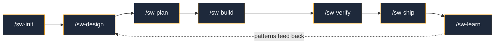

<p align="center">
  
</p>

<p align="center">
  <a href="https://github.com/Obsidian-Owl/specwright/releases"></a>
  <a href="LICENSE"></a>
  <a href="https://github.com/Obsidian-Owl/specwright/stargazers"></a>
</p>

<p align="center">
  <b>AI agents optimise for <i>done</i>. Specwright optimises for <i>works</i>.</b>
</p>

---

Most spec-driven frameworks help you plan. Then they leave you on your own.

Specwright closes the **entire loop** — plan, build, verify, ship, learn. Every requirement is tracked to implementation evidence. Every PR ships with proof, not promises.

### Without Specwright

- AI optimises for "task done" not "feature works"
- Fast delivery of broken, unwired code
- Tests pass but features aren't connected
- Context loss during long sessions causes drift
- No evidence trail for what was verified
- Every project re-invents the same workflow

### With Specwright

- Specs before implementation, always
- Wiring verification catches orphaned code and broken connections
- Evidence-based PRs with gate proof for every acceptance criterion
- Compaction recovery reloads full context automatically
- Learning system captures failures and promotes patterns across sessions
- One install, configure once, works with any language or framework

## What Makes This Different

Other tools in this space focus on the **specification phase** — they help you write a plan, then hand off to the AI. The hard part isn't planning. It's everything after: does the code actually do what was asked? Is it wired up? Is it secure? Can you prove it?

Specwright focuses on the **verification and evidence** side — the part where AI agents actually fail.

**Evidence Pipeline** — Five sequential gates capture proof into structured reports. PRs ship with a compliance matrix mapping every acceptance criterion to code and test evidence. Reviewers don't have to trust — they can verify.

**Wiring Verification** — Static analysis catches orphaned files, unused exports, layer violations, and circular dependencies. Other tools check if code compiles and tests pass. Specwright checks if the code is actually connected.

**Learning System** — Failures are captured, patterns are promoted, and learnings compact into tiered memory (index, themes, raw data). The system gets smarter with every session. Knowledge survives context windows.

**Compaction Recovery** — All stateful skills support resume-from-crash. When Claude's context window compacts, Specwright reloads full state from disk. The only plugin in this space that handles context loss gracefully.

## How It Works



| Phase | What Happens | Key Innovation |
|-------|-------------|----------------|
| **Init** | Detect stack, configure gates, create anchor documents | Auto-detection — don't ask what you can infer |
| **Design** | Research codebase, design solution, adversarial critic review | Every design challenged before you commit |
| **Plan** | Decompose into work units, write testable acceptance criteria | Specs grounded in approved design artifacts |
| **Build** | TDD — tester writes hard-to-pass tests, executor makes them pass | Adversarial test-first, not test-after |
| **Verify** | 5 quality gates with evidence capture | Findings shown inline, not just pass/fail badges |
| **Ship** | PR with acceptance criteria mapped to evidence | Every requirement traceable to code + test |
| **Learn** | Capture patterns, promote to constitution | Knowledge compounds across sessions |

## Quick Start

Install the plugin:
```
/plugin marketplace add Obsidian-Owl/specwright
/plugin install specwright@specwright
```

Initialize your project:
```
/sw-init
```

Optionally, set up automated guardrails (linters, hooks, CI checks):
```
/sw-guard
```

Then design, plan, build, verify, ship:
```
/sw-design add-user-authentication
/sw-plan
/sw-build
/sw-verify
/sw-ship
```

## Six Specialized Agents

Specwright delegates to purpose-built agents — each with a distinct role, model, and adversarial stance:

| Agent | Model | Role | Mindset |
|-------|-------|------|---------|
| **Architect** | Opus | Design review, critic, structural analysis | *"What did you miss? What will break?"* |
| **Tester** | Opus | Write tests designed to be hard to pass | *"How can I prove this is wrong?"* |
| **Executor** | Sonnet | Make the tests pass. Minimal code, maximum correctness. | *"What's the simplest thing that works?"* |
| **Reviewer** | Opus | Spec compliance verification | *"Show me the evidence."* |
| **Build Fixer** | Sonnet | Fix build/test failures with minimal diffs | *"Get green, don't refactor."* |
| **Researcher** | Sonnet | External documentation and API lookup | *"What does the official doc say?"* |

## Five Quality Gates

Every work unit passes through configurable gates before shipping. **Default stance: FAIL.** Evidence must prove PASS.

| Gate | Checks | Severity |
|------|--------|----------|
| **Build** | Compilation + test suite pass | BLOCK |
| **Tests** | Assertion strength, boundary coverage, mock discipline | BLOCK/WARN |
| **Security** | Leaked secrets, injection patterns, sensitive data | BLOCK |
| **Wiring** | Orphaned files, unused exports, layer violations, circular deps | WARN |
| **Spec** | Every acceptance criterion mapped to code + test evidence | BLOCK |

## Anchor Documents

Two persistent documents drive all decisions and survive context compaction:

**`CONSTITUTION.md`** — Development practices the AI must follow. Testing standards, coding conventions, security requirements. Not suggestions — rules.

**`CHARTER.md`** — Technology vision and architectural invariants. What this project is, who consumes it, what doesn't change.

## Skills

<table>
<tr><td>

**Core Workflow**
| Skill | Purpose |
|-------|---------|
| `/sw-init` | Project setup, constitution, charter |
| `/sw-design` | Research, design, adversarial critic |
| `/sw-plan` | Decompose, spec, acceptance criteria |
| `/sw-build` | TDD implementation |
| `/sw-verify` | Quality gates |
| `/sw-ship` | PR with evidence |

</td><td>

**Utilities**
| Skill | Purpose |
|-------|---------|
| `/sw-guard` | Configure guardrails (hooks, CI) |
| `/sw-status` | Progress and state |
| `/sw-learn` | Pattern capture |

</td></tr>
</table>

<details>
<summary><b>Configuration</b></summary>

Specwright reads project configuration from `.specwright/config.json`:

```json
{
  "project": { "name": "...", "languages": [...] },
  "commands": { "build": "...", "test": "...", "lint": "..." },
  "gates": { "enabled": ["build", "tests", "wiring", "security", "spec"] }
}
```

All configuration is project-specific. Specwright never assumes language, framework, or architecture.

</details>

<details>
<summary><b>Architecture</b></summary>

See `DESIGN.md` for the complete architecture document.

```
specwright/
├── skills/       # 14 SKILL.md files (9 user + 5 gates)
├── protocols/    # 10 shared protocols (loaded on demand)
├── agents/       # 6 custom subagent definitions
├── hooks/        # Session lifecycle hooks
├── DESIGN.md     # Full architecture
└── README.md
```

</details>

## Contributing

Specwright is open source under the MIT license.

1. Fork at [github.com/Obsidian-Owl/specwright](https://github.com/Obsidian-Owl/specwright)
2. Create a feature branch
3. See `CLAUDE.md` for development guidelines
4. Submit a pull request

---

<p align="center">
  <sub>Built by <a href="https://github.com/Obsidian-Owl">ObsidianOwl</a> · MIT License · v0.5.0</sub>
</p>
