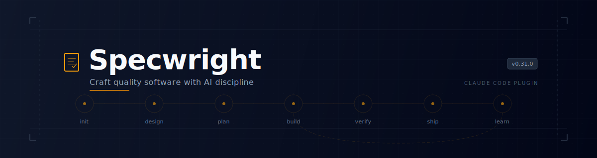
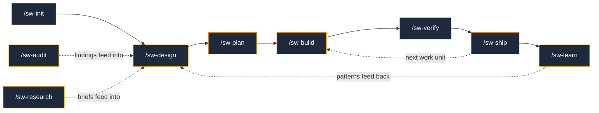

<p align="center">
  
</p>

<p align="center">
  <a href="https://github.com/Obsidian-Owl/specwright/releases"></a>
  <a href="LICENSE"></a>
  <a href="https://github.com/Obsidian-Owl/specwright/stargazers"></a>
  <a href="https://docs.anthropic.com/en/docs/agents-and-tools/claude-code/plugins"></a>
  <a href="https://opencode.ai"></a>
  <a href="https://developers.openai.com/codex/"></a>
</p>

<p align="center">
  <b>AI agents optimise for <i>done</i>. Specwright optimises for <i>works</i>.</b>
</p>

---

## Why Specwright?

AI agents optimise for "done." That's the problem. Code compiles, tests pass, CI is green — and three days later you find an export nobody imports, a handler that's never called, a validation rule that exists in the spec but not in the code. **The hard part isn't writing code. It's proving it works.**

Specwright closes the **entire loop** — design, plan, build, verify, ship, learn. Every requirement is tracked to implementation evidence. Every PR ships with proof, not promises.

### Without Specwright

- AI optimises for "task done" not "feature works"
- Fast delivery of broken, unwired code
- Tests pass but features aren't connected
- Context loss during long sessions causes drift
- No evidence trail for what was verified
- Every project re-invents the same workflow

### With Specwright

- Specs before implementation, always
- Wiring verification catches orphaned code and broken connections
- Evidence-based PRs with gate proof for every acceptance criterion
- Compaction recovery reloads full context automatically
- Learning system captures failures and promotes patterns across sessions
- Codebase knowledge persists across sessions — no re-discovering the same architecture
- Periodic health checks find systemic debt that per-change gates miss
- One install, configure once, works with any language or framework
- Cross-platform: works with Claude Code, Opencode, Codex CLI, and any agent that reads [`AGENTS.md`](./AGENTS.md)

### How It Compares

| Capability | Specwright | [Spec Kit](https://github.com/github/spec-kit) | [Oh-My-ClaudeCode](https://github.com/Yeachan-Heo/oh-my-claudecode) | [Superpowers](https://github.com/obra/superpowers) | Manual workflows |
|---|---|---|---|---|---|
| Structured spec writing | Yes | **Yes** — core strength | Yes | Yes | DIY |
| Adversarial TDD (separate tester/executor) | **Yes** | No | Yes | Yes | No |
| Wiring verification (orphaned code, layer violations) | **Yes** | No | No | No | No |
| Evidence-based PRs (criterion → code + test) | **Yes** | No | No | No | No |
| Quality gates with findings (not just badges) | **Yes** | Partial | Yes | Partial | DIY |
| Compaction recovery | **Yes** | No | Yes | No | No |
| Learning system (patterns promoted across sessions) | **Yes** | No | Yes | Yes | No |
| Codebase knowledge persistence | **Yes** | No | Yes | No | No |

Every tool in this space pushes AI-assisted development forward. Specwright's focus is the **verification and evidence gap** — the part between "tests pass" and "it actually works."

## What Makes This Different

Other tools in this space tend to focus on the **front half** of the loop — specification authoring, agent orchestration, or planning scaffolds — then hand off to the AI. The hard part isn't planning or delegation. It's everything after: does the code actually do what was asked? Is it wired up? Is it secure? Can you prove it?

Specwright focuses on the **verification and evidence** side — the part where AI agents actually fail.

**Autonomous Gated Engineering** — Skills operate autonomously between human gates, applying a decision protocol grounded in Amazon's Type 1/Type 2 framework, Google's SRE heuristics, and the Principle of Least Surprise. Every autonomous decision is recorded in `decisions.md` and surfaced at the gate handoff. Humans review at skill transitions — like reviewing a PR, not like pair programming. 64 intervention points reduced to 5 human gates.

**Tiered Test Execution** — `gate-build` runs four test tiers in order: build → unit → integration → smoke. Integration tests validate against real infrastructure (databases, clusters, APIs). Smoke tests verify critical paths end-to-end. The inner-loop in `sw-build` runs integration tests after TDD — catching runtime issues while the build-fixer is still in context, just like a real engineer who starts the app and checks it works before submitting a PR.

**Evidence Pipeline** — Six sequential gates capture proof into structured reports. PRs ship with a compliance matrix mapping every acceptance criterion to code and test evidence. Reviewers don't have to trust — they can verify.

**Wiring Verification** — Static analysis catches orphaned files, unused exports, layer violations, and circular dependencies. Other tools check if code compiles and tests pass. Specwright checks if the code is actually connected.

**Learning System** — Failures are captured, patterns are promoted, and learnings compact into tiered memory (index, themes, raw data). The system gets smarter with every session. Knowledge survives context windows.

**Codebase Knowledge** — During init, Specwright surveys your codebase and builds a persistent knowledge document (`LANDSCAPE.md`) covering architecture, modules, conventions, and gotchas. Design phases load this instantly instead of re-scanning. It stays current — refreshed when stale, incrementally updated after every shipped work unit.

**Codebase Health Checks** — Run `/sw-audit` periodically to find systemic issues that per-change gates miss: architecture debt, complexity growth, convention drift, accumulated workarounds. Findings persist in `AUDIT.md` with stable IDs across re-runs. Design phases surface relevant findings. The learn phase resolves them when addressed.

**Compaction Recovery** — All stateful skills support resume-from-crash. When Claude's context window compacts, Specwright reloads full state from disk — including workflow stage, work unit queue, and gate progress — so no manual re-orientation is needed.

## How It Works


```mermaid
graph LR
    A["/sw-init"] --> B["/sw-design"]
    B --> C["/sw-plan"]
    C --> D["/sw-build"]
    D --> E["/sw-verify"]
    E --> F["/sw-ship"]
    F -.->|next work unit| D
    F --> G["/sw-learn"]
    G -.->|patterns feed back| B
    H["/sw-audit"] -.->|findings feed into| B
    I["/sw-research"] -.->|briefs feed into| B

    style A fill:#1e293b,stroke:#f59e0b,color:#f8fafc
    style B fill:#1e293b,stroke:#f59e0b,color:#f8fafc
    style C fill:#1e293b,stroke:#f59e0b,color:#f8fafc
    style D fill:#1e293b,stroke:#f59e0b,color:#f8fafc
    style E fill:#1e293b,stroke:#f59e0b,color:#f8fafc
    style F fill:#1e293b,stroke:#f59e0b,color:#f8fafc
    style G fill:#1e293b,stroke:#f59e0b,color:#f8fafc
    style H fill:#1e293b,stroke:#f59e0b,color:#f8fafc
    style I fill:#1e293b,stroke:#f59e0b,color:#f8fafc
```

| Phase | What Happens | Key Innovation |
|-------|-------------|----------------|
| **Init** | Detect stack, configure gates, create anchor documents | Auto-detection — don't ask what you can infer |
| **Research** | Investigate external docs, APIs, patterns; produce validated briefs | Evidence-graded findings with confidence scoring |
| **Design** | Research codebase, design solution, adversarial critic — autonomously with gate handoff | Decisions recorded, human reviews at the gate |
| **Plan** | Decompose into work units, write testable acceptance criteria | Specs grounded in approved design artifacts |
| **Build** | TDD + inner-loop validation against real infrastructure. Optional parallel execution (experimental). | Integration tests run during build, not just at verify |
| **Verify** | 6 quality gates with tiered test execution and evidence capture | Findings shown inline, not just pass/fail badges |
| **Ship** | PR with acceptance criteria mapped to evidence | Every requirement traceable to code + test |
| **Learn** | Capture patterns, auto-promote by objective criteria | Knowledge compounds across sessions |
| **Audit** | Periodic health check — architecture, complexity, consistency, debt | Finds systemic issues gates miss. Run anytime. |

## Quick Start

<details open>
<summary><b>Claude Code</b></summary>

```
/plugin marketplace add Obsidian-Owl/specwright
/plugin install specwright@specwright
```

</details>

<details>
<summary><b>Opencode</b></summary>

Add the plugin to your `opencode.json`:

```json
{
  "plugin": ["@obsidian-owl/opencode-specwright@latest"]
}
```

Opencode installs the package automatically on next startup — no manual `npm install` needed.

</details>

<details>
<summary><b>Codex CLI</b></summary>

Install for your user account:

```sh
curl -fsSL https://raw.githubusercontent.com/Obsidian-Owl/specwright/main/scripts/install-codex.sh | bash -s -- --user
```

Or install into the current repository:

```sh
curl -fsSL https://raw.githubusercontent.com/Obsidian-Owl/specwright/main/scripts/install-codex.sh | bash -s -- --repo
```

Then open Codex and enable the plugin from the plugin directory:

```text
/plugins
```

The installer downloads the latest prebuilt Codex bundle from GitHub Releases,
installs it into `plugins/specwright` under the selected scope, and updates the
matching Codex marketplace manifest.
It requires `curl`, `tar`, and `python3`.

To update later:

```sh
curl -fsSL https://raw.githubusercontent.com/Obsidian-Owl/specwright/main/scripts/install-codex.sh | bash -s -- --update --user
```

Manual install:
- Download `specwright-codex.tar.gz` from [GitHub Releases](https://github.com/Obsidian-Owl/specwright/releases).
- Extract it to `~/plugins/specwright` for a user install or `<repo>/plugins/specwright` for a repo install.
- Add a `specwright` entry to `~/.agents/plugins/marketplace.json` or `<repo>/.agents/plugins/marketplace.json` with `source.path` set to `./plugins/specwright`.

Packaged Codex installs use the prebuilt plugin bundle and its bundled
slash-command contract. If you are developing Specwright itself and only need
repo-local skills-only mode, use the source tree directly instead of the
packaged installer above.

This enables:
- `/sw-*` slash commands
- Session hooks (resume context + shipping guard + continuation snapshots)

</details>

<details>
<summary><b>Other Agents (AGENTS.md compatible)</b></summary>

Any AI coding agent that reads [`AGENTS.md`](./AGENTS.md) can use Specwright's core skills directly. Copy or symlink the `core/` directory into your project and point your agent at `AGENTS.md`.

</details>

Initialize your project:
```
/sw-init
```

Optionally, set up automated guardrails (linters, hooks, CI checks):
```
/sw-guard
```

Then design, plan, and iterate per work unit:
```
/sw-design add-user-authentication
/sw-plan

# for each work unit:
/sw-build
/sw-verify
/sw-ship
```

## Codebase Knowledge and Health

Two optional features keep Specwright informed about your codebase across sessions:

**Landscape** (`LANDSCAPE.md`) — A persistent map of your codebase's architecture, modules, conventions, and integration points. Created automatically during `/sw-init` if you opt in. The design phase loads it for instant context instead of re-scanning every time. Updated incrementally after each shipped work unit.

- Created by: `/sw-init` (survey phase, optional)
- Consumed by: `/sw-design` (auto-refreshed when stale)
- Updated by: `/sw-learn` (after shipping)

**Audit** (`AUDIT.md`) — A persistent record of systemic codebase health issues. Run `/sw-audit` when you want a health check — it's not part of the regular workflow, so use it whenever it makes sense: before starting a large feature, after a refactoring sprint, or on a regular cadence.

```
/sw-audit              # auto-triage: standard or full based on codebase size
/sw-audit src/api/     # focused: analyze only the specified path
/sw-audit --full       # full: parallel analysis across all dimensions
```

Findings persist across runs with stable IDs. When you design new work, relevant findings are surfaced automatically. When you ship work that addresses a finding, the learn phase marks it resolved.

- Created by: `/sw-audit` (run anytime)
- Consumed by: `/sw-design` (surfaces relevant findings during research)
- Resolved by: `/sw-learn` (marks addressed findings as resolved)

**Research** (`.specwright/research/`) — Validated, referenced briefs about external systems: API documentation, SDK contracts, industry patterns, best practices. Run `/sw-research` before design when you need deep external context. Briefs are confidence-scored and stale after 90 days.

```
/sw-research stripe webhooks     # research a specific topic
/sw-research react server components  # deep dive into a technology
```

- Created by: `/sw-research` (run anytime, no sw-init required)
- Consumed by: `/sw-design` (loads relevant briefs during research phase)

## Six Specialized Agents

Specwright delegates to purpose-built agents — each with a distinct role, model, and adversarial stance:

| Agent | Model | Role | Mindset |
|-------|-------|------|---------|
| **Architect** | Opus | Design review, critic, structural analysis | *"What did you miss? What will break?"* |
| **Tester** | Opus | Write tests designed to be hard to pass | *"How can I prove this is wrong?"* |
| **Executor** | Sonnet | Make the tests pass. Minimal code, maximum correctness. | *"What's the simplest thing that works?"* |
| **Reviewer** | Opus | Spec compliance verification | *"Show me the evidence."* |
| **Build Fixer** | Sonnet | Fix build/test failures — checks infrastructure health first | *"Get green, don't refactor."* |
| **Researcher** | Sonnet | External documentation and API lookup | *"What does the official doc say?"* |

## Six Quality Gates

Every work unit passes through configurable gates before shipping. **Default stance: FAIL.** Evidence must prove PASS.

| Gate | Checks | Severity |
|------|--------|----------|
| **Build** | Tiered test execution: build → unit → integration → smoke | BLOCK (smoke = WARN) |
| **Tests** | Assertion strength, boundary coverage, mock discipline | BLOCK/WARN |
| **Security** | Leaked secrets, injection patterns, sensitive data | BLOCK |
| **Wiring** | Orphaned files, unused exports, layer violations, circular deps | WARN |
| **Semantic** | Error-path cleanup, unchecked errors, fail-open handling, resource lifecycle | WARN |
| **Spec** | Every acceptance criterion mapped to code + test evidence | BLOCK |

## Persistent Documents

Three **anchor documents** drive all decisions and survive context compaction:

**`CONSTITUTION.md`** — Development practices the AI must follow. Testing standards, coding conventions, security requirements. Not suggestions — rules.

**`CHARTER.md`** — Technology vision and architectural invariants. What this project is, who consumes it, what doesn't change.

**`TESTING.md`** *(optional)* — Testing strategy for the project. Classifies boundaries as internal (test with real components), external (mock with contracts), or expensive (mock with rationale). Created during `/sw-init` if the user opts in. Consumed by the tester agent and test quality gate.

Three optional **reference documents** accelerate research and track health:

**`LANDSCAPE.md`** — Codebase knowledge: architecture, modules, conventions, gotchas. Loaded on demand, never blocks workflow.

**`AUDIT.md`** — Codebase health findings: systemic debt, complexity growth, convention drift. Loaded on demand, findings have stable IDs.

**`research/*.md`** — External research briefs: API contracts, SDK docs, industry patterns. Confidence-scored, stale after 90 days.

## Experimental: Parallel Builds with Agent Teams

When a work unit has 4+ independent tasks, Specwright can execute them in parallel using [Claude Code Agent Teams](https://docs.anthropic.com/en/docs/claude-code/agent-teams). Each teammate works in an isolated git worktree, runs the full TDD cycle with its own tester/executor agents, and commits independently. The lead cherry-picks results onto the feature branch.

**Requirements:** `SPECWRIGHT_AGENT_TEAMS=1` env var + `config.experimental.agentTeams.enabled: true`. Falls back to sequential execution when prerequisites aren't met — no errors, no configuration needed to ignore it.

## Skills

<table>
<tr><td>

**Core Workflow**
| Skill | Purpose |
|-------|---------|
| `/sw-init` | Project setup, constitution, charter |
| `/sw-design` | Autonomous design with gate handoff |
| `/sw-plan` | Autonomous decomposition and specs |
| `/sw-build` | TDD + inner-loop integration tests |
| `/sw-verify` | 6 quality gates, tiered execution |
| `/sw-ship` | PR with evidence |

</td><td>

**Utilities**
| Skill | Purpose |
|-------|---------|
| `/sw-research` | Deep external research briefs |
| `/sw-debug` | Investigation-first debugging |
| `/sw-pivot` | Research-backed rebaselining for active work. Preserves completed and shipped scope. |
| `/sw-doctor` | Installation health check |
| `/sw-guard` | Configure guardrails (hooks, CI) |
| `/sw-status` | Progress and state |
| `/sw-adopt` | Explicitly adopt an existing work into the current worktree |
| `/sw-learn` | Pattern capture |
| `/sw-audit` | Codebase health check |
| `/sw-sync` | Git housekeeping |
| `/sw-review` | PR comment triage |

</td></tr>
</table>

### Pivoting Active Work

`/sw-pivot` is research-backed rebaselining for work in `planning`, `building`,
or `verifying`. It can revise design, plan, and in-progress work while
preserving completed scope and shipped scope as the baseline instead of
rewriting what is already done.

If a requested change would rewrite shipped scope, discard history, or needs a
brand-new direction, use `/sw-design <changes>` instead of forcing `/sw-pivot`.
If branch-head freshness blocks `/sw-build`, `/sw-verify`, or `/sw-ship` and
`rebase`/`merge` reconcile is configured, Specwright recovers in the same
stage or run. `manual` remains the explicit fallback: reconcile the current
branch against the recorded target in the owning worktree, then rerun the
blocked stage; shipping still reruns `/sw-verify` before `/sw-ship`.

<details>
<summary><b>Configuration</b></summary>

Specwright resolves state through Git logical roots. In the shared/session
layout, repo-wide config, anchor docs, and work records live under
`git rev-parse --git-common-dir` + `/specwright`, while the current worktree's
session and continuation files live under `git rev-parse --git-dir` +
`/specwright`. Legacy checkout-local `.specwright/` is migration fallback
only.

Project configuration is read from the shared repo state root:

```json
{
  "project": { "name": "...", "languages": [...] },
  "commands": { "build": "...", "test": "...", "test:integration": "...", "test:smoke": "...", "lint": "..." },
  "gates": { "enabled": ["build", "tests", "wiring", "security", "semantic", "spec"] }
}
```

All configuration is project-specific. Specwright never assumes language, framework, or architecture.

</details>

<details>
<summary><b>Architecture</b></summary>

See `DESIGN.md` for the complete architecture document.

```
specwright/
├── core/              # Platform-agnostic content
│   ├── skills/        # 22 SKILL.md files (16 user + 6 gates)
│   ├── protocols/     # 27 shared protocols (loaded on demand)
│   └── agents/        # 6 custom subagent definitions
├── adapters/          # Platform-specific packaging
│   ├── claude-code/   # Claude Code adapter (hooks, plugin metadata)
│   ├── opencode/      # Opencode adapter (plugin.ts, commands, skill overrides)
│   └── codex/         # Codex adapter (.codex-plugin, commands, hooks)
├── build/             # Build pipeline
│   ├── build.sh       # Builds platform packages (core + adapters → dist/)
│   └── mappings/      # Per-platform transformation configs
├── .agents/           # Codex repo-local skills + plugin marketplace
├── AGENTS.md          # Universal project instructions (Agent Skills standard)
├── DESIGN.md          # Full architecture
└── README.md
```

Runtime state is worktree-aware rather than checkout-singleton: shared work and
project records live under the Git common-dir `specwright/` root, and each
worktree keeps its own `session.json` plus `continuation.md` under that
worktree's Git admin dir.

</details>

## Contributing

Specwright is open source under the MIT license.

1. Fork at [github.com/Obsidian-Owl/specwright](https://github.com/Obsidian-Owl/specwright)
2. Create a feature branch
3. See `CLAUDE.md` for development guidelines
4. Submit a pull request

---

<p align="center">
  If Specwright helps you ship with confidence, <a href="https://github.com/Obsidian-Owl/specwright">a ⭐ helps others find it</a>.
</p>

<p align="center">
  <sub>Built by <a href="https://github.com/Obsidian-Owl">ObsidianOwl</a> · MIT License · v0.31.0</sub>
</p>
